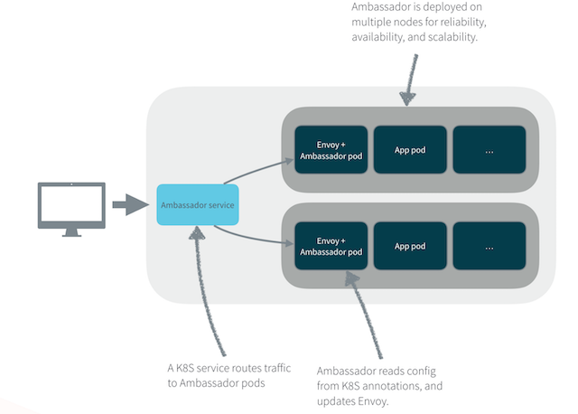

# Ambassador

## Introduction
Ambassador is an open source, Kubernetes-native microservices API gateway built on the Envoy Proxy. Envoy is an L7 proxy and communication bus designed for large modern service
oriented architectures. Ambassador is built from the ground up to support multiple, independent teams that need to rapidly publish, monitor, and update services for end users.
Ambassador can also be used to handle the functions of a Kubernetes ingress controller and load balancer

## Ambassador Architecture:



**Ambassador is**:

+ Self-service: Ambassador is designed so that developers can manage services directly. This requires a system that is not only easy for developers to use but provides
    safety and protection against inadvertent operational issues.
+ Operations friendly: Ambassador operates as a sidecar process to the Envoy Proxy and integrates Envoy directly with Kubernetes. Thus, all routing, failover, health checking
    are handled by battle-tested, proven systems.
+ Designed for microservices:  Ambassador integrates the features teams need for microservices, including authentication, rate limiting, observability, routing,
    TLS termination, and more.

## Folder Description

```
.
├── README.md
├── ambassador-service-mesh
│   ├── README.md
│   └── ambassador-edge
├── bluegreen
│   ├── bluegreen-purge.sh
│   ├── bluegreen-test.sh
│   └── bluegreen.sh
├── campaign
│   ├── campaign-purge.sh
│   ├── campaign-test.sh
│   └── campaign.sh
├── helm-todo-app
│   ├── Chart.yaml
│   ├── charts
│   ├── templates
│   └── values.yaml
├── images
│   ├── Ambassador.png
│   ├── LyftEnvoy.png
│   └── ambassador-highlevel.png
└── todo-app-green
    ├── Jenkinsfile
    ├── README.md
    ├── manual-k8s-deploy
    ├── setenv.sh
    ├── todo-api-java
    ├── todo-app-green.iml
    ├── todo-app.png
    ├── todo-ui
    └── user-api
```

**ambassador-service-mesh:** This contains the edge proxy. There will be an ambassador component bundled along with envoy edge proxy.
**bluegreen:** Contains scripts that will showcase `blue-green` deployment.
**campaign:** Contains scripts that showcases campaign (A/B) deployment
**helm-todo-app:** Helm chart for the `demo todo-app` created by Architech.
**images:** Images used by Readme.
**todo-app-green:** Changed the css of todo-app to showcase difference in the application.

### Blue Green

Blue-green deployment is a technique that reduces downtime and risk by running two identical production environments called Blue and Green. At any time, only one of the
environments is live, with the live environment serving all production traffic.

#### Usage:
##### Ambassador Edge Proxy
1. Run the command `helm install --name ambassador-edge ./ambassador-edge`. Adjust the path appropriately for `ambassador-edge` folder.
2. Run command `kubectl get svc ` and wait for the edge proxy for the acquire ip.
3. On another terminal run command `kubectl logs <ambassador pods`, to see the envoy configuration.

##### Blue Green Deployment
1. Run the `bluegreen.sh`. It run the helm chart with the right set of attribute for blue green deployment.This will created
   two namespaces , namely blue and green.
2. Ensure that the pods are running on the respective namespaces and all the services have received their IP.
3. Install chrome  [ plugin ](https://chrome.google.com/webstore/detail/modify-headers-for-google/innpjfdalfhpcoinfnehdnbkglpmogdi) for modifying the request.

4. Add a header `x-namespace` and add value `blue`. Then add fresh row and add `green`. Enable one plugin at a time
5. From the browsers, enter the ip address of the edge proxy. The application that is serviced will be dependent on the header that is inserted.

##### A/B Deployment
1. Run the `campaign.sh`. It run the helm chart with the right set of attribute for A/B deployment.This will created
   two namespaces , namely campaign-blue and campaign-green.
2. Ensure that the pods are running on the respective namespaces and all the services have received their IP.
3. Add `blue.architech.ca` and `green.architech.ca` to `/etc/host`. This will ensure that the `host` field in the http header is populated. The edge proxy will route the request to the right application based on the host that is provided.
